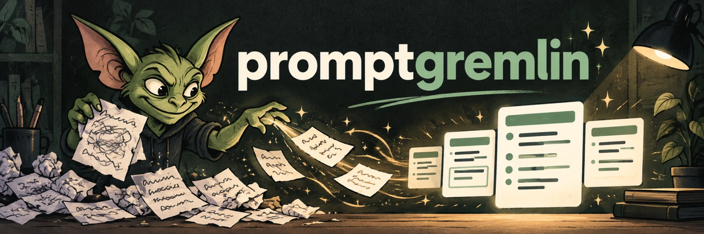

# promptgremlin

Turns a braindump, rough notes, or a weak prompt into a paste-ready prompt for
any registered AI model or tool, written to that vendor's current official
guidance. Every run checks the vendor's model list and watched doc sections,
and flags new releases, retired models, changed guidance, and stale notes.

## What it does

Modes: `rewrite` (default; splits multi-part asks into ordered prompts), `port`
(move a prompt to another target), `autopsy` (diagnose a weak prompt). Each
prompt comes with an effort suggestion naming the real control on that surface,
a short list of assumptions and changes, and a one-line freshness report.

## Supported targets

33 targets. Use the key or any alias.

Model families:

- `anthropic`: `claude`, `claude-ai`, `claude-api`
- `openai`: `gpt`, `chatgpt`, `openai-api`
- `gemini`: `google-gemini`, `gemini-api`
- `xai`: `grok`, `x-ai`
- `zhipu`: `glm`, `z-ai`, `zai`
- `qwen`: `alibaba`, `qwen-api`
- `deepseek`: `deepseek-api`
- `mistral`: `mistral-ai`
- `meta`: `muse`, `llama`, `meta-ai`
- `kimi`: `moonshot`, `kimi-api`

Tools and products (a tool that sits on a model family also loads that family's notes):

- `claude-code`: `cc` (also loads `anthropic` notes)
- `codex`: `codex-cli`, `openai-codex` (also loads `openai` notes)
- `gemini-cli`: `gemini-code` (also loads `gemini` notes)
- `cursor`: `cursor-agent`, `windsurf`
- `copilot`: `github-copilot`
- `lovable`: `lovable-dev`
- `replit`: `replit-agent`
- `perplexity`: `pplx`
- `manus`: `manus-ai`
- `nano-banana`: `nanobanana`, `gemini-image`
- `gpt-image`: `openai-image`, `dall-e`
- `midjourney`: `mj`
- `google-video`: `veo`, `flow`, `omni`, `gemini-omni`, `google-flow`
- `sora`: `openai-video`
- `runway`: `runwayml`
- `kling`: `kling-ai`
- `higgsfield`: `higgsfield-ai`
- `elevenlabs`: `eleven-labs`, `11labs`
- `n8n`: `n8n-ai`
- `gamma`: `gamma-app`
- `notion-ai`: `notion`, `notion-agents`
- `jev`: `typesafe`
- `grok-bot`: `grokbot`, `grok-bots` (also loads `xai` notes)

## Install

Claude Code (marketplace):

    claude plugin marketplace add dean815/promptgremlin
    claude plugin install promptgremlin@promptgremlin

claude.ai (skill upload): build the zip, then upload `dist/promptgremlin.zip` as a custom skill.

    tools/build-claude-ai-zip.sh

Without a shell, the skill falls back to fetching the vendor pages with
whatever web tool is available, or to the bundled notes alone.

## Network and privacy

Full details: [PRIVACY.md](PRIVACY.md).

- Each run fetches the target's vendor documentation pages (and model-list
  pages) over HTTPS with an identifying user agent,
  `promptgremlin/2.0 (+https://github.com/dean815/promptgremlin)`. It does not
  pretend to be a browser.
- Responses are cached in `~/.cache/promptgremlin` for 24 hours. Override the
  location with `PROMPTGREMLIN_CACHE`. The briefing header labels each state:
  `live` (fetched this run), `cached` (under 24 hours old, no request made),
  `stale` (cache served after a failed fetch or offline).
- Nothing you write is sent anywhere: requests carry only the vendor page URLs.
- The Midjourney and Runway notes are fetched from those vendors' public
  help-center JSON API.
- Fetched text is treated as reference material, never as instructions.

## Config

`~/.config/promptgremlin/config.json`, all keys optional:

    {
      "default_target": "claude-code",
      "pin_model": "opus-5-5",
      "context_sources": ["a skill or folder the prompt may draw on"],
      "clipboard": "pbcopy"
    }

`clipboard` is a local command that the skill runs, with the first prompt on
its standard input. Set it only to a command you trust.

## Limitations

- The notes in `skills/promptgremlin/targets/` are paraphrased summaries of
  vendor guidance and can lag the vendors. When a watched section changes or the
  notes are old, the run flags it (`DRIFT`, `STALE`) and says so in the
  Guidance line; the changed text wins over the notes.
- Freshness checks need network access. Offline, the notes are used as they are
  and the run says so.
- A vendor redesign can break a page parse; the run reports `FETCH-FAIL` rather
  than guessing.

## Maintenance

    python3 skills/promptgremlin/scripts/guidance.py --check-all
    python3 skills/promptgremlin/scripts/guidance.py --refresh <target>
    python3 skills/promptgremlin/scripts/guidance.py --refresh <target> --commit

A weekly GitHub Action runs the check and keeps one issue updated when anything
drifts.

## Evals

`evals/RESULTS.md` reports 98% of assertions passed with the skill versus 50% without. That
measures compliance with the skill's output contract and targeted behaviour checks (10 evals,
several runs each, model-graded against fixed assertions). It does not show that the rewritten
prompts give better downstream answers; a benchmark for that is planned. Runs used a personal
config and run artifacts are not published.

## Tests

    python3 skills/promptgremlin/scripts/run_tests.py

## Trademarks

Product names are trademarks of their owners. This project is not affiliated
with or endorsed by any of them.

## License

MIT
